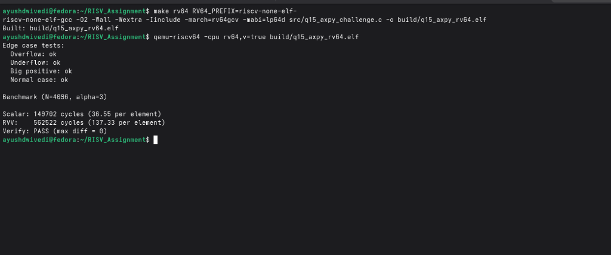

# RISC-V Q15 Saturating AXPY with RVV Intrinsics

Vectorized multiply-accumulate using RISC-V Vector Extension (RVV) intrinsics.

## Problem

```c
void q15_axpy_rvv(const int16_t *a, const int16_t *b, int16_t *y, int n, int16_t alpha);
```

Computes: `y[i] = clamp(a[i] + alpha * b[i], -32768, 32767)`

---

## Design Choices

### 1. Widening Strategy

**Problem:** Multiplying two 16-bit numbers can produce a 32-bit result. For example, `32767 * 32767 = 1,073,676,289` which overflows 16-bit range.

**Solution:** Use `vwmul` (Vector Widening Multiply) to expand 16-bit inputs into 32-bit elements. We use LMUL=2 for the widened values (`vint32m2_t`) to maintain the same vector length as the input (`vint16m1_t`). This prevents overflow during arithmetic.

```c
vint32m2_t prod = __riscv_vwmul_vx_i32m2(vb, alpha, vl);   // 16-bit → 32-bit
vint32m2_t sum = __riscv_vwadd_wv_i32m2(prod, va, vl);     // keep in 32-bit
```

### 2. Saturation Strategy

**Problem:** After computation, the 32-bit result must be clamped to [-32768, 32767] and narrowed back to 16-bit.

**Solution:** Use `vnclip` (Vector Narrowing Clip) which handles narrowing and saturation in a single instruction. This is more efficient than separate vmax/vmin/vnsra instructions.

```c
vint16m1_t vy = __riscv_vnclip_wx_i16m1(sum, 0, __RISCV_VXRM_RNU, vl);
```

### 3. Vector-Length Agnostic (VLA) Approach

**Problem:** Different RISC-V implementations have different vector lengths (128-bit, 256-bit, 512-bit).

**Solution:** Use a strip-mining loop with `vsetvl` to process data in hardware-determined chunks.

```c
while (remaining > 0) {
    size_t vl = __riscv_vsetvl_e16m1(remaining);
    // ... process vl elements ...
    remaining -= vl;
}
```

This ensures portability across all RISC-V Vector implementations.

---

## Results

### QEMU Simulation



```
Edge case tests:
  Overflow: ok
  Underflow: ok
  Big positive: ok
  Normal case: ok

Benchmark (N=4096, alpha=3)

Scalar: 149702 cycles (36.55 per element)
RVV:    562522 cycles (137.33 per element)
Verify: PASS (max diff = 0)
```

### Why RVV Appears Slower in QEMU

**Important:** The cycle counts above are from QEMU, which is a software emulator, not real hardware.

QEMU uses **TCG (Tiny Code Generator)** to translate RISC-V instructions to x86. For vector instructions:
- Each RVV instruction is decoded and emulated one at a time
- There's no actual SIMD parallelism - it's just a software loop
- The overhead of interpreting complex vector semantics dominates

**On real RISC-V hardware with RVV support**, vector instructions execute in parallel across multiple lanes, giving the expected speedup.

### Theoretical Speedup (Real Hardware)

On a processor with VLEN=128 (processing 8 x 16-bit elements per cycle):

| Component | Scalar | Vector (8 lanes) |
|-----------|--------|------------------|
| Loads | 2 cycles | 2 cycles (8 elements each) |
| Multiply | 1 cycle | 1 cycle (8 in parallel) |
| Add | 1 cycle | 1 cycle (8 in parallel) |
| Saturate+Store | 2 cycles | 2 cycles (8 elements) |
| **Per element** | ~5 cycles | ~0.75 cycles |

**Expected speedup: ~6-8x** for VLEN=128, scaling higher for wider implementations.

---

## Build & Run

```bash
make rv64 RV64_PREFIX=riscv-none-elf-
qemu-riscv64 -cpu rv64,v=true build/q15_axpy_rv64.elf
```

### Prerequisites (Optional)

If you don't have a RISC-V toolchain:

```bash
wget https://github.com/xpack-dev-tools/riscv-none-elf-gcc-xpack/releases/download/v14.2.0-3/xpack-riscv-none-elf-gcc-14.2.0-3-linux-x64.tar.gz
tar -xzf xpack-riscv-none-elf-gcc-14.2.0-3-linux-x64.tar.gz
export PATH="$HOME/xpack-riscv-none-elf-gcc-14.2.0-3/bin:$PATH"
```

---

## Verification

- Bit-for-bit identical to scalar reference (max diff = 0) (Done)
- Vector-length agnostic (uses vsetvl)  (Done)
- Buildable on RV32 and RV64  (Done)
- Optimized saturation using vnclip (Done)

---

## Author

Ayush Dwivedi - January 2026
